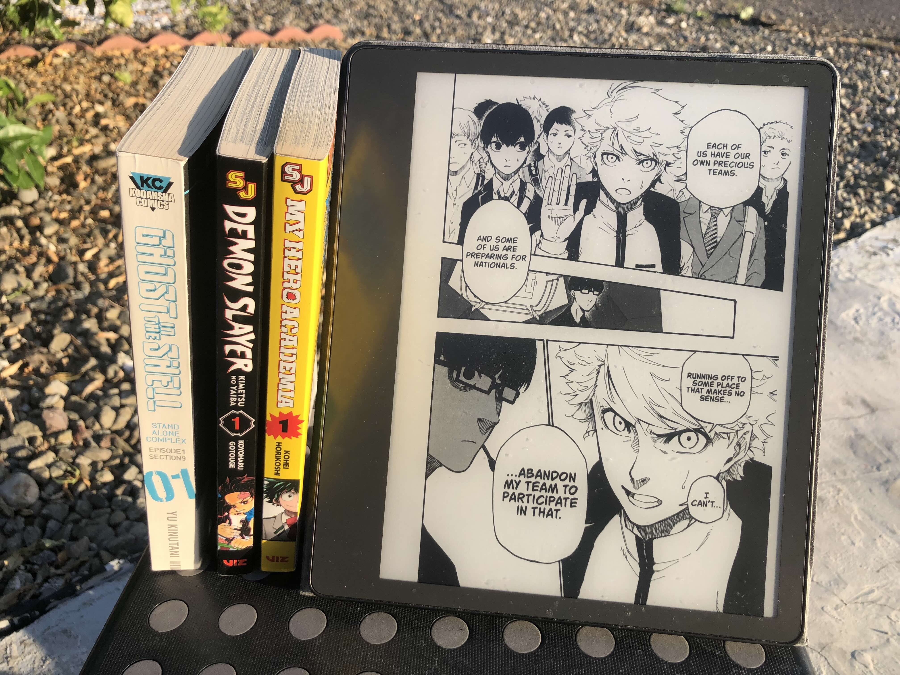

# Kindle Comic Converter (KCC) - 中文版本
原项目地址：[https://github.com/ciromattia/kcc](https://github.com/ciromattia/kcc)
因为不太懂github，断开了复刻链接，但因为我应该不会更新，所以无所谓了。

## 简介

**Kindle Comic Converter (KCC)** 是一款专为电子墨水阅读器优化黑白或彩色漫画和漫画的工具。支持 Kindle、Kobo、reMarkable 等设备。页面全屏显示，无边距，支持固定布局。

该中文版主要是为了满足自己的需求。内部所有链接皆与原作者原来的设置一致，请不要因为中文版去打扰原作者。

### 支持的输入格式：

- 包含 JPG/PNG/GIF/WebP 图片文件的文件夹
- CBZ、ZIP 压缩包（需要 7-Zip）
- CBR、RAR 压缩包（需要 7-Zip）
- CB7、7Z 压缩包（需要 7-Zip）
- PDF（仅提取 JPG 图片）

### 支持的输出格式：

- MOBI/AZW3
- EPUB
- KEPUB
- CBZ
- PDF

***

## 系统要求

**⚠️ 仅支持 Windows 系统（Windows 10 及以上）**

### 必须安装：

- Python 3.9 或更高版本
- 7-Zip（可选，但能显著加快转换速度，部分高级功能需要）

### 可选安装：

- Kindle Previewer（用于获取 KindleGen 以生成 MOBI 文件）

***

## 安装与使用（从源代码运行）

### 方法一：使用启动脚本（推荐）

1. 确保已安装 Python 3.9+
2. 双击运行 `启动.bat`
3. 首次运行时会自动创建虚拟环境并安装所有依赖
4. 后续运行会直接启动程序

### 方法二：手动运行

#### 首次设置：

```bash
python -m venv venv
venv\Scripts\activate.bat
pip install -r requirements.txt
python kcc.py
```

#### 后续每次运行：

```bash
venv\Scripts\activate.bat
python kcc.py
```

***

## 使用说明

### 基本使用：

1. 将输入文件或文件夹拖放到 KCC 窗口
2. 调整设置（悬停在每个选项上可查看详细说明）
3. 点击「转换」按钮
4. 通过 USB 将生成的文件放到设备的 `documents` 文件夹

### 高级技巧：

- 按住 `Shift` 点击「转换」按钮可以更改默认输出目录
- 使用元数据编辑器（点击「元数据编辑器」按钮）可以编辑书籍信息
- 漫画模式适合从右到左阅读的漫画
- 条漫模式适合竖向阅读的条漫（以韩漫居多）

***

## 设备配置文件

| 代码    | 设备                                    | 分辨率       |
| ----- | ------------------------------------- | --------- |
| K11   | Kindle 11                             | 1072x1448 |
| KPW5  | Kindle Paperwhite 5/Signature Edition | 1236x1648 |
| KPW6  | Kindle Paperwhite 6                   | 1272x1696 |
| KO    | Kindle Oasis 2/3                      | 1264x1680 |
| KCS   | Kindle Colorsoft                      | 1272x1696 |
| KS    | Kindle Scribe 1/2                     | 1860x2480 |
| KS3   | Kindle Scribe 3                       | 1986x2648 |
| KoC   | Kobo Clara HD/Kobo Clara 2E           | 1072x1448 |
| KoL   | Kobo Libra H2O/Kobo Libra 2           | 1264x1680 |
| KoS   | Kobo Sage                             | 1440x1920 |
| Rmk1  | reMarkable 1                          | 1404x1872 |
| Rmk2  | reMarkable 2                          | 1404x1872 |
| RmkPP | reMarkable Paper Pro                  | 1620x2160 |

***

## 常见问题

### Q: 可以使用 Calibre 吗？

A: 不建议。Calibre 不完全支持固定布局的 EPUB/MOBI，修改 KCC 输出文件会破坏格式，也会破坏页码。建议直接通过 USB 传输到设备。

### Q: 应该使用什么输出格式？

A: Kindle 用 MOBI，Kobo 用 KEPUB，reMarkable 用 PDF，Koreader 用 CBZ。

### Q: 如何将转换好的书放到设备上？

A: 直接通过 USB 将 mobi/kepub 文件拖放到 Kindle/Kobo 的 documents 文件夹。

### Q: 有空白页面？

A: 可能是在 Kindle Scribe 上使用 PNG 导致的，尝试使用 JPG。后退几页再重新进入可临时修复。

### Q: Kindle 面板视图不工作？

A: 虚拟面板视图在 Kindle 的 Aa 菜单中启用，而不是在 KCC 中。

### Q: 颜色反转？

A: 关闭 Kindle 的深色模式。

***

## 关于这个版本的修改

### 主要修改：

1. ✅ **完整中文本地化** - 所有界面文本已翻译为中文，若有遗漏无伤大雅，
2. ✅ **禁用 GitHub API** - 完全离线运行，不进行版本检查和公告获取
3. ✅ **Windows 专用** - 已删除 Linux/macOS /win7相关文件，仅保留 Windows 版本（win7除外）
4. ✅ **启动脚本** - 提供 `启动.bat` 一键启动，自动管理虚拟环境，不将依赖安装到系统中，删除整个文件夹即可同时将安装的所有依赖一并删除。
5. ✅删除PyInstaller 打包支持

### 保留的功能：

- 核心漫画转换功能
- 元数据编辑器
- 所有设备配置文件
- 所有图像处理选项

***

## 版权与致谢

**KCC** 由以下作者开发：

- Ciro Mattia Gonano
- Paweł Jastrzębski
- Darodi
- Alex Xu

**KCC** 根据 ISC 许可证发布，详情请参阅 [LICENSE.txt](./LICENSE.txt)。

***

## 声明

**KCC** 不是亚马逊的 Kindle Comic Creator，也未得到亚马逊的任何认可。亚马逊的工具是为漫画出版商设计的，需要大量手动工作，而 **KCC** 是为漫画/漫画读者设计的。
